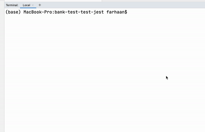
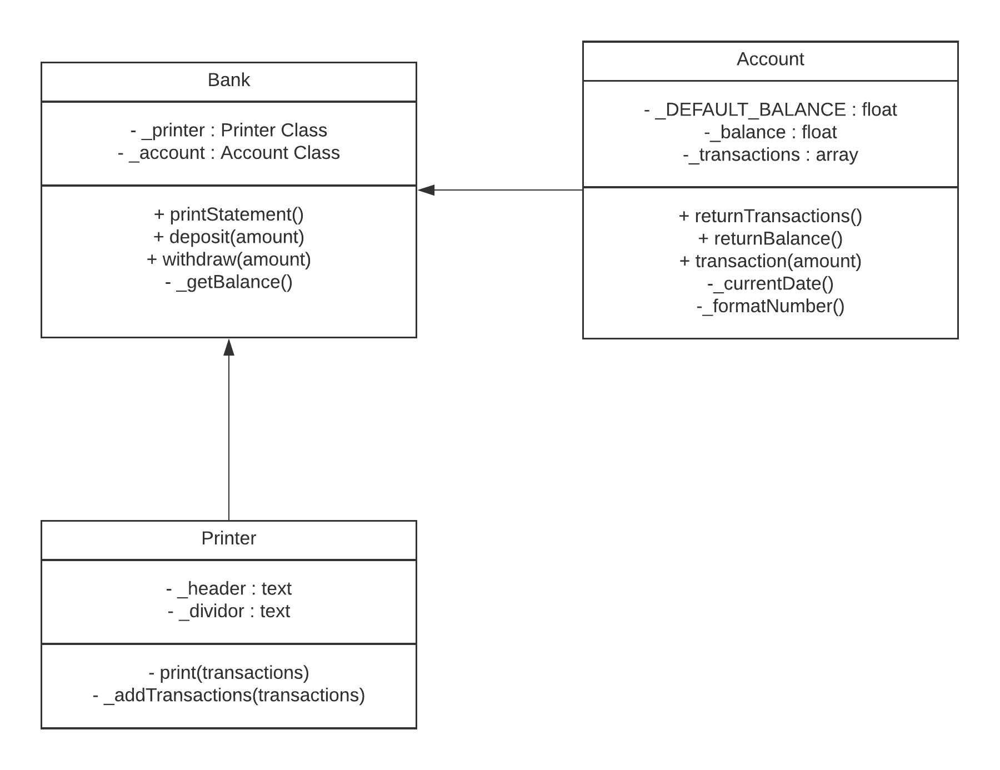

# Bank Tech Test

[](https://travis-ci.com/farhaan-ali/bank-tech-test)

## About
This is a simple bank application that runs in the node REPL that allows a customer to deposit and withdraw money from a bank account alongside printing a statement in the REPL.

## Quickstart

Dependencies: Note you must have NPM and Node installed.

1. Clone this repo
2. Navigate to the repo in your terminal
3. Run the application and interact wth the bank
```bash
$ npm install
$ node
```
```js
//require and initiate bank instance
let Bank = require('./src/bank.js');
let bank = new Bank();
//deposit money into the bank
bank.deposit(INSERT_AN_AMOUNT)
//withdraw money from the bank
bank.withdraw(INSERT_AN_AMOUNT)
//print your statement from the bank
bank.printStatement()
```
### Screen Preview


## Running Tests
Navigate to the repo in your terminal
```bash
$ npm test
```
## Technologies

| Area                 | Technology                 |
| -------------------- | -------------------------- |
| Language           | Javascript|
| CI/CD                | Travis                     |
| Testing and Coverage | Jest |
| Linting | Prettier |


## Specification

### Requirements

* You should be able to interact with your code via a REPL like IRB or the JavaScript console.  (You don't need to implement a command line interface that takes input from STDIN.)
* Deposits, withdrawal.
* Account statement (date, amount, balance) printing.
* Data can be kept in memory (it doesn't need to be stored to a database or anything).

### Acceptance criteria

**Given** a client makes a deposit of 1000 on 10-01-2012  
**And** a deposit of 2000 on 13-01-2012  
**And** a withdrawal of 500 on 14-01-2012  
**When** she prints her bank statement  
**Then** she would see

```
date || credit || debit || balance
14/01/2012 || || 500.00 || 2500.00
13/01/2012 || 2000.00 || || 3000.00
10/01/2012 || 1000.00 || || 1000.00
```

## Planning:

### User Stories
```
As a account holder
I would like to make a deposit into my bank account
```
```
As a account holder
I would like to make a withdrawal into my bank account
```
```
As a account holder
I would like to get a bank statement
that prints the most recent transaction first
```

### Functionality
* We need to store the date, credit, debit and balance for an account for a given day
* Bank statement needs to be printed with a certain format as outlined above
* User should be able to make a deposit - this stores the amount credited to the account and the date and a snapshot of the current balance
* User should be able to make a debit - this withdraws an amount from the account and the date and current snapshot of balance is stored. 

#### What is the interface like?

* User interacts with just the deposit , withdraw and getStatement functions in the class 

#### What can the data structure be to store the information?

* Could use a hash where the key is the date, and the value is another hash storing any credits or debits
the downside to this approach is a hash doesn't always return in the order it was created due to how it is saved in memory.
Also, what if we have multiple entries do we store an array as a value for the second hash as below with the order of the array showing in which order things happened

```
{14/01/2012: {credit: [2000, 1000], debit: [500]}}
```  

* Alternatively we can have an array of hashes which store each transaction in order, because ultimately we have a digital ledger
which is recording each transaction that will be printed in the statement (note this would print the statement from the beginning of time unless we add a check)

```
FILO principle: 
[{date: value, credit: value, debit: value, balance: value}, {date: value, credit: value, debit: value, balance: value}]
```

### Assumptions
* Input will always be a numeric type
* Account can be overdrawn 
* Transactions can't be edited retrospectively 
* No confirmation message for a successful deposit or withdrawal 

### Improvements
This section discusses improvements that can be made if more time was allocated.
* Check for input type + error handling for invalid input
* Don't let balances be withdrawn
* Add confirmation messages for successful deposit or withdrawal

### ULM Class Diagram
